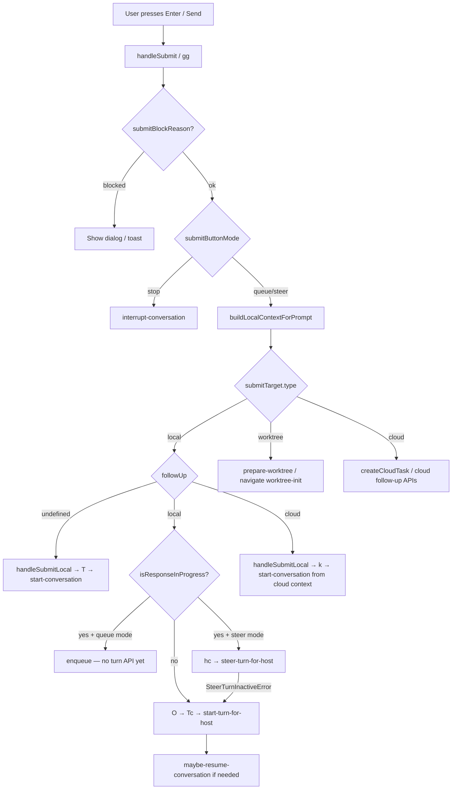

> 本文是 [composer-message-lifecycle.md](../composer-message-lifecycle.md) 的中文翻译，以英文原文为准。

# Composer 消息发送生命周期

> 逆向工程自 `extracted/webview/assets/`（Codex v26.609.41114）。  
> 相关：[codex-architecture.md](./codex-architecture.md)、[reasoning-effort-prefix-session.md](./reasoning-effort-prefix-session.md)、插件 `plugins/reasoning-effort-prefix/index.js`。

本文梳理用户从输入框（composer）发送一条消息时 Codex 调用了**哪些桥接（bridge）API**、各自**何时**被使用，以及如何把插件行为钩入官方路径（而不是伪造的 DOM 重提交）。

---

## 目录

1. [高层流程](#1-high-level-flow)
2. [关键状态：followUp 与 composerMode](#2-key-state-followup-vs-composermode)
3. [桥接 API 参考](#3-bridge-api-reference)
4. [rollout 上的 effort 从何而来](#4-where-effort-comes-from-on-rollout)
5. [reasoning-effort-prefix 今天为什么失败](#5-why-reasoning-effort-prefix-fails-today)
6. [钩入策略](#6-hook-strategies)
7. [源文件](#7-source-files)

---

## 1. 高层流程（High-level flow）

用户按下 Enter 或发送按钮 → `composer-Bc_CiLgC.js` 中的 `handleSubmit` / `gg()`。

```
Enter / Send
    → handleSubmit (gg)
    → validate blocks, goal replacement, side-chat shortcuts
    → buildLocalContextForPrompt + thread references
    → choose submitAction: stop | queue | steer
    → dispatch via submitTarget by composerMode
```

### 决策树（Decision tree）



### 按 composerMode 划分的 submitTarget

| `composerMode` | `submitTarget.type` | 提交函数 | 桥接 API |
|----------------|---------------------|-----------------|---------------|
| `local` | `local` | `handleSubmitLocal` → `yb()` 中的 `O()` | 见 [local follow-up](#local-existing-thread) |
| `worktree` | `worktree` | worktree 初始化流程 | `prepare-worktree-snapshot`，导航到 `/worktree-init-v2/...` |
| `cloud` | `cloud` | `zm()` / 云端任务 API | 云端任务创建，不走本地桥接的回合（turn）API |

---

## 2. 关键状态：followUp 与 composerMode（Key state: followUp vs composerMode）

二者是**正交的**。`followUp` 决定是新建还是使用已有会话线程；`composerMode` 决定执行目标是本地、worktree 还是云端。

### `followUp`（会话线程是否已存在？）

| `followUp` | 含义 | 本地提交（`yb` → `handleSubmitLocal`） |
|------------|---------|-------------------------------------------|
| `{ type: "local", localConversationId }` | 已存在的本地线程 | `O()` → `Tc()` 或 `hc()` |
| `{ type: "cloud", ... }` | 云端任务跟进 | `k()` → `start-conversation` |
| `undefined` | 新线程（主页 / 无活动线程） | `T()` → `start-conversation` |

**`start-conversation` 只用于新线程**（主页、云端 fork、worktree 初始化完成后）。在 `/local/:id` 中的跟进消息使用回合（turn）API，而不是 `start-conversation`。

### 本地已有线程（`yb()` 中的 `O()`）

调用 `Tc()`（逻辑与 `mention-metadata-syncer-O6MYPBSp.js` 中的 `je()` 相同）：

| 回合状态 | API |
|------------|-----|
| 回合 `inProgress` + steer 模式 | `steer-turn-for-host`（遇到 `SteerTurnInactiveError` 时回退到 `start-turn-for-host`） |
| 无进行中的回合 | 直接 `start-turn-for-host` |

可选的前置步骤：若会话需要恢复，则先 `maybe-resume-conversation`。

**`start-turn-for-host` 的载荷（来自 composer）：**

```javascript
{
  hostId,
  conversationId,
  params: {
    input: [{ type: "text", text, text_elements: [] }, ...images],
    cwd,
    model: null,    // inherits latestThreadSettings
    effort: null,   // inherits via collaborationMode (see §4)
    serviceTier,
    approvalPolicy,
    attachments,
    collaborationMode,  // from React activeMode — critical for effort
    ...
  }
}
```

### 新线程（`yb()` 中的 `T()`）

- 通过 `yc()` / `Gr()` / `build-start-conversation-params` 构建参数
- 带附件调用 **`start-conversation`**
- 导航到 `/local/{conversationId}`

### 排队（queue）路径

当响应进行中且启用了队列模式时：

- **不会**立即调用回合 API
- `enqueue({ text, context, cwd })` —— 本地队列 UI
- 当 `followUp.type === "local"` 且 `isResponseInProgress` 时，`followUpSubmitAction === "queue"`

---

## 3. 桥接 API 参考（Bridge API reference）

所有 type 都经由 `window.electronBridge.sendMessageFromView({ type, ... })` 发送（由 Explodex SDK 的 `bridge.send` 包装）。

### 设置类（只改 effort，不发消息）

| API | 调用时机 | 载荷 |
|-----|-------------|---------|
| **`update-thread-settings-for-next-turn`** | UI 的推理（reasoning）下拉框；插件 | `{ conversationId, threadSettings: { model, effort } }` |
| **`set-default-model-config-for-host`** | 无活动线程 / 主页 composer | `{ hostId, model, reasoningEffort, profile }` |

**处理函数**（`app-main-B-r-lCO_.js`）：

```javascript
"update-thread-settings-for-next-turn": async (manager, { conversationId, threadSettings }) => {
  await manager.updateThreadSettingsForNextTurn(conversationId, threadSettings);
}
```

**Manager**（`thread-context-inputs-BhGjWqLR.js` — `updateThreadSettingsForNextTurn`）：

- 按会话（conversation）跟踪 `pendingThreadSettingsUpdates` promise
- 通过 `Zu()` 合并进 `latestThreadSettings`（设置 `effort`，更新 `latestCollaborationMode.settings.reasoning_effort`）
- 回合启动时会先调用 `waitForPendingThreadSettingsUpdate(conversationId)` 再读取 effort

**UI 守卫**（`use-model-settings-B1SsY8bO.js`）：

```javascript
C = r(sC, conversationId)  // sC: thread exists in manager (gw[conversationId] != null)
D = async (model, effort) => conversationId == null || !C
  ? false
  : (await bridge("update-thread-settings-for-next-turn", { conversationId, threadSettings: { model, effort } }), true)
```

插件应镜像这个 `sC` 守卫；在线程未加载时调用该桥接是空操作，或会更新到错误的 manager。

### 回合 API（composer 本地路径）

| API | 调用时机 |
|-----|-------------|
| **`start-turn-for-host`** | 已有线程、空闲（无进行中回合） |
| **`steer-turn-for-host`** | 回合进行中 + steer 模式 |
| **`maybe-resume-conversation`** | 线程已暂停 / steer 前需要恢复 |
| **`interrupt-conversation`** | 停止按钮 —— `{ conversationId, initiatedBy: "user" }` |

### 新线程

| API | 调用时机 |
|-----|-------------|
| **`start-conversation`** | `followUp === undefined`、云端 fork、worktree 完成 |
| **`prewarm-thread-start-for-host`** | 首个回合之前的可选预热 |

### `send-follow-up-message` —— 不是 composer 的 Enter 路径

**主 composer 并不使用它。** 使用方为：

- `app-server-dynamic-tools-*.js`（MCP 工具）
- Avatar 覆盖层
- `mcp-capability-view-frame`（当前线程的 prompt）

处理函数（`app-main-B-r-lCO_.js`，节选）：

```javascript
"send-follow-up-message": async (manager, { conversationId, prompt, model, reasoningEffort, serviceTier }) => {
  await maybeResume(...);
  if (model != null || reasoningEffort !== undefined) {
    await manager.updateThreadSettingsForNextTurn(conversationId, { model, effort: reasoningEffort ?? ... });
  }
  // steer-turn or start-turn with minimal text input
}
```

它在单个处理函数中协调设置 + 发送，但**跳过**了 composer 的上下文构建器（附件、IDE 上下文、提及）。

### 其他 composer 相邻 API

| API | 作用 |
|-----|------|
| `interrupt-conversation` | 中止进行中的回合 |
| `maybe-resume-conversation` | 回合前恢复已暂停的线程 |
| Side chat | 带新 `targetConversationId` 的 `Tc()` |
| Goal / worktree / cloud | `gg()` 中的独立分支 |

---

## 4. rollout 上的 effort 从何而来（Where effort comes from on rollout）

Rollout JSONL 中 `type == "turn_context"` → `.payload.effort` 以及 `.payload.collaboration_mode.settings.reasoning_effort`。

`thread-context-inputs-BhGjWqLR.js` 中的回合启动函数 `Rp`：

```javascript
S = a.collaborationMode != null
T = S ? null : (a.effort === void 0 ? C : a.effort)
// ...
effort: T  // in thread/start request
```

当 `collaborationMode` 存在时（正常的 composer 提交），**`params.effort` 会被强制置为 `null`**。effort 取自 **`collaborationMode.settings.reasoning_effort`**，而不是在请求时直接取自 `latestThreadSettings`。

### 提交时 collaborationMode 如何构建

1. `gg()` 调用 `buildLocalContextForPrompt(prompt, undefined, conversationId)` —— 第二个参数 `collaborationMode` 通常是 `undefined`
2. `start-turn-for-host` 使用 `collaborationMode: context.collaborationMode ?? activeCollaborationMode`
3. `activeCollaborationMode` 来自 `use-collaboration-mode` → 把 `modelSettings.reasoningEffort` 叠加到模式设置之上
4. `modelSettings.reasoningEffort` 来自 `use-model-settings` → 每线程的 signal `et`（manager）或宿主配置

**UI 下拉框：** 用户修改 effort → `update-thread-settings-for-next-turn` → 用户**稍后**发送 → React 重新渲染 → `activeMode.settings.reasoning_effort` 是最新的 → rollout 匹配。

**插件（今天）：** 桥接更新 → 去掉前缀 → **约 32ms 后伪造 Enter** → 在 React 重新渲染之前就提交 → `activeMode` **过期** → rollout 不变。

---

## 5. reasoning-effort-prefix 今天为什么失败（Why reasoning-effort-prefix fails today）

| | UI | 插件（当前） |
|---|-----|------------------|
| 设置 effort | `update-thread-settings-for-next-turn` | 相同 ✓ |
| 时序 | 先改 effort，稍后再发送 | `await` 设置后立即伪造重提交 |
| 发送路径 | 原生 `gg` → `start-turn-for-host` | 伪造的 `keydown` / 按钮点击 |
| 线上携带的 effort | 来自 React 的新鲜 `collaborationMode` | 过期的 `collaborationMode` |

### 失败模式（按严重程度排序）

1. **React collaboration mode 过期**（主因）—— manager 已更新；提交时仍在 `collaborationMode` 里发送旧的 `reasoning_effort`
2. **伪造提交** —— ProseMirror 在 Enter 键映射上使用内部的 `f.emit("submit")`，而不是 `window` 上的 DOM `keydown`
3. **DOM 文本裁剪** —— 提交读取的是来自 ProseMirror doc 的 `composerController.getText()`，不是 `textContent`；通过 execCommand 的 `setComposerText` 可能造成失同步
4. **缺少 `sC` 守卫** —— 线程不在 manager atom `gw` 中时更新了设置
5. **队列 / 进行中** —— 官方路径会用 `steer-turn-for-host`；伪造提交可能不遵循该分支

### 不是问题的点

- 设置 API 名字用错（`threadSettings.effort` 是正确的，与 UI 相同）
- Composer 在 params 中故意发送 `effort: null`（设计如此；effort 经由 `collaborationMode` 流转）

---

## 6. 钩入策略（Hook strategies）

**不要把伪造 Enter 当作主要的发送机制。**

### 方案 D —— 输入时实时应用 + 恢复（prefix 插件的首选）

一旦检测到**有效**前缀（`!xh ` 等）就立即应用 `update-thread-settings-for-next-turn`，而不是等到 Enter。Intelligence UI 应在输入过程中就更新。发送后（回合已启动）恢复此前的 effort，或在被删除/失效时恢复。从 composer 文本中剥离原始前缀，并在 `aboveComposer` portal 中显示一个 effort 小胶囊。用户使用**原生 Enter** 发送 —— 无需伪造重提交。见 [reasoning-effort-prefix-session.md §11](./reasoning-effort-prefix-session.md#11-option-d-live-apply--restore--pill)。

### 方案 A —— 拦截前缀，等 React 同步后再走原生提交

1. 前缀匹配时在 Enter 上 `preventDefault`
2. `await update-thread-settings-for-next-turn`
3. 通过 ProseMirror 安全的替换方式剥离前缀（等价于 `composerController.setPromptText`，而非仅操作 DOM）
4. 等待 manager/React 同步（`requestAnimationFrame` × 2、会话回调，或微任务链）
5. 触发**原生**提交（走 ProseMirror 的 submit 事件路径，不是原始 DOM Enter）

保持在官方 `gg` → `handleSubmitLocal` → `start-turn-for-host` 路径上，携带完整上下文（附件、提及、IDE）。

### 方案 B —— `send-follow-up-message`

```javascript
await bridge.send("send-follow-up-message", {
  conversationId,
  prompt: strippedText,
  reasoningEffort: level.effort,
  model: null,
  serviceTier,
});
```

设置 + 发送原子完成。但会跳过 composer 上下文构建器。

### 方案 C —— 直接调用 `start-turn-for-host` 并显式指定 effort

1. `update-thread-settings-for-next-turn`
2. `await wait` / manager 回调
3. 调用 `start-turn-for-host`，传入**显式的** **`effort: "medium"`** 和 **`collaborationMode: null`**，让 `Rp` 在 `waitForPendingThreadSettingsUpdate` 之后从 `latestThreadSettings` 读取

回合进行中时必须分支到 `steer-turn-for-host`。必须自行构建上下文或接受缩减的上下文。

### 方案 D —— 更新 React 可见状态

桥接更新后，失效/更新与 `use-model-settings` 相同的 React Query key，使 `use-collaboration-mode` 在提交前看到新的 `reasoning_effort`。

### 仅限新线程

在 `start-conversation` 之前使用 `set-default-model-config-for-host`（插件在 `conversationId` 为 null 时已有此回退）。

---

## 7. 源文件（Source files）

| 路径 | 角色 |
|------|------|
| `extracted/webview/assets/composer-Bc_CiLgC.js` | `handleSubmit` / `gg()`、`yb()`、`submitTarget`、队列 |
| `extracted/webview/assets/mention-metadata-syncer-O6MYPBSp.js` | `je()` / `Tc()` → `start-turn-for-host`、`steer-turn-for-host` |
| `extracted/webview/assets/app-main-B-r-lCO_.js` | 桥接处理函数注册表 |
| `extracted/webview/assets/thread-context-inputs-BhGjWqLR.js` | `updateThreadSettingsForNextTurn`、`Rp` 回合启动、`waitForPendingThreadSettingsUpdate` |
| `extracted/webview/assets/use-model-settings-B1SsY8bO.js` | UI 的 effort API、`sC` 守卫 |
| `extracted/webview/assets/use-collaboration-mode-C3U79kbx.js` | 提交时的 `activeMode.settings.reasoning_effort` |
| `extracted/webview/assets/composer-controller-CNXNPPdo.js` | ProseMirror Enter → `f.emit("submit")` |
| `plugins/reasoning-effort-prefix/index.js` | Explodex 插件（当前实现） |
| `sdk/explodex-sdk.js` | `bridge.send`、composer 辅助函数 |

### 验证

观察 rollout 上的 effort：

```bash
tail -f ~/.codex/sessions/.../rollout-*.jsonl \
  | jq -c 'select(.type=="turn_context") | {ts:.timestamp, effort:.payload.effort, model:.payload.model}'
```
