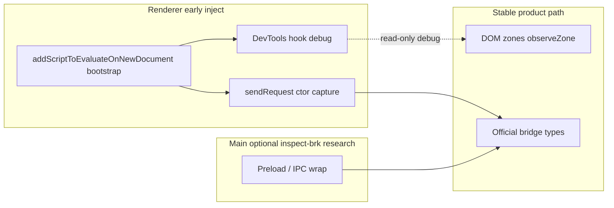

> 本文是 [early-injection-and-inspect-brk.md](../early-injection-and-inspect-brk.md) 的中文翻译，以英文原文为准。

# 早期注入、`--inspect-brk` 与大规模补丁

> 日期：2026-06-22  
> 背景：承接 [sdk-fragility.md](./sdk-fragility.md) §1（AppServer `call/apply` 捕获），并回答"早期断点是否能实现 React 组件 / props 拦截"这一问题。  
> 相关：[codex-root-runtime.md](./codex-root-runtime.md)、[codex-architecture.md](./codex-architecture.md) §11、[composer-message-lifecycle.md](./composer-message-lifecycle.md)。

本文解释 `--inspect-brk` 在 Codex/Electron 中究竟暂停了什么，它与 Explodex 现有 CDP 早期注入路径相比如何，启动阶段哪些"大规模"补丁是现实的，以及为什么它们仍然无法泛化为向任意 React 组件注入 props。

**状态：** 仅研究 / 架构指引 —— 尚未实现任何 bootstrap 或 inspect-brk 启动模式。

---

## 目录

1. [执行摘要](#1-执行摘要)
2. [两个进程与两条时钟](#2-两个进程与两条时钟)
3. [Explodex 已有的做法](#3-explodex-已有的做法)
4. [分层的“大规模”补丁目标](#4-分层的大规模补丁目标)
5. [早期补丁能否注入 React props？](#5-早期补丁能否注入-react-props)
6. [推荐架构](#6-推荐架构)
7. [研究 spike 手动流程](#7-研究-spike-手动流程)
8. [反模式](#8-反模式)
9. [后续工作](#9-后续工作)

---

## 1. 执行摘要

| 问题 | 回答 |
|----------|--------|
| `--inspect-brk` 会在 React 加载前暂停它吗？ | **不会** —— 它暂停的是 **Electron 主进程**，不是 webview 渲染进程。 |
| 已经存在一条"在页面 JS 之前断下"的路径吗？ | **有** —— `scripts/cdp-inject.ts` 里的 CDP `Page.addScriptToEvaluateOnNewDocument`（`world: "MAIN"`）。 |
| 我们能打一个大规模补丁并注入组件 props 吗？ | **只能在狭窄、有针对性的方式下** —— 不能作为通用的 React 拦截框架。 |
| 对 Explodex 最好的大规模早期补丁是什么？ | **DevTools hook + 构造函数位点 `sendRequest` 捕获** —— 而不是加宽 `Function.prototype.call/apply`。 |
| 最稳定的产品路径是什么？ | DOM 区域 + 官方桥接 API（[codex-architecture.md](./codex-architecture.md) §10–12）。 |

`--inspect-brk` 给人的感觉是"暂停整个宇宙，装上一个上帝钩子，再恢复运行"。实际上你要选择**哪个 isolate**（主进程还是渲染进程）以及**哪个咽喉点**（preload、前言脚本、Fetch 重写）。渲染进程的 React 集成需要**在模块加载前进入渲染进程**，而 `addScriptToEvaluateOnNewDocument` 只要在导航前注册（或注册后重载）就已经提供了这一点。

---

## 2. 两个进程与两条时钟

Electron 版 Codex 至少运行着两个与 Explodex 相关的 V8 isolate：

```
┌─────────────────────────────────────────────────────────────┐
│ Main process (--inspect-brk=9229 pauses HERE)               │
│  bootstrap.js → main-*.js                                     │
│  BrowserWindow, preload path, IPC handler registration      │
└──────────────────────────┬──────────────────────────────────┘
                           │ creates window + loads preload
                           ▼
┌─────────────────────────────────────────────────────────────┐
│ Renderer (webview/index.html + Vite ES module chunks)       │
│  --remote-debugging-port=9333 (CDP attach, no auto-break)   │
│  React SPA, composer, in-renderer AppServer router          │
└─────────────────────────────────────────────────────────────┘
```

| 目标 | 典型标志 | 暂停 / 附加的内容 |
|--------|--------------|------------------------|
| **主进程** | `Codex --inspect-brk=9229` | 在 `runMainAppStartup()` 继续之前暂停 Node bootstrap。阻塞直到调试器附加并恢复。 |
| **渲染进程** | `--remote-debugging-port=9333` | 供 DevTools/MCP 使用的 CDP 服务器。**不会**在首行断下，除非你设置断点或使用早期脚本注入。 |
| **页面 JS 之前的渲染进程** | CDP `Page.addScriptToEvaluateOnNewDocument` | 脚本在每次导航时于**主 world**中、文档自身脚本之前运行。 |

**含义：** 主进程的 `inspect-brk` 是做 **preload / IPC / window options** 的正确层级。它**并不**直接暂停 React。渲染进程的 React 钩子需要**渲染进程早期前言脚本**，或在注册 `addScriptToEvaluateOnNewDocument` **之后重载**。

Preload（`preload.js`）运行在一个带 `contextBridge` 的**隔离 world** 中 —— 除非刻意暴露更多表面，它无法看到主 world 里的 React fiber。

---

## 3. Explodex 已有的做法

`scripts/cdp-inject.ts` 通过以下方式注册 SDK（以及目录清单）：

1. **`Page.addScriptToEvaluateOnNewDocument`** —— `world: "MAIN"` —— 在新文档上先于页面脚本运行。
2. **`Runtime.evaluate`** —— 立即注入到已加载的页面。

`scripts/launch.sh` 以 `--remote-debugging-port=9333` 启动 Codex，并在端口就绪后运行注入器。

### 为什么 AppServer 捕获如今仍然会失败

SDK 顶部的 `Function.prototype.call/apply` 猴子补丁（位于 `sdk/explodex-sdk.js`）是一个**迟到的启发式**：

- 注入往往发生在 React 与渲染进程内路由**已经初始化之后**。
- 路由方法可能是以**直接调用**（`sendRequest(type, payload)`）而非 `.call/.apply` 的方式被调用，因此该陷阱从未绑定 `__explodexAppServerSend`。

早期前言注入解决的是**时机**问题；它本身并不能解决**钩子点选错**的问题（原型补丁 vs 构造函数捕获）。参见 [sdk-fragility.md](./sdk-fragility.md) §1 与 [reasoning-effort-prefix-session.md](./reasoning-effort-prefix-session.md) §12。

### 迟到附加的缓解措施

`EXPLODEX_TARGET_WATCH_MS`（默认 `8000`）是启动期间继续监视额外渲染进程 target 的上限时间；注入器在首次注入后若连续两次轮询（间隔 250ms）未发现新 target 即提前退出，因此通常在约 0.5 秒内返回。依赖 React 所辖 DOM 的插件应使用 `observeZone()`，并且如果 bootstrap 必须在模块之前运行，则在 inject 后重载渲染进程。

---

## 4. 分层的“大规模”补丁目标

“大规模”指影响面很广 —— 只有当补丁是**有针对性的**且**有遥测支撑**时才可接受；把应用里每一次函数调用都包一层是不可接受的。

### Tier A —— 渲染进程早期前言脚本（性价比最高）

在 `webview/index.html` 加载其模块图**之前**注入。通过 `addScriptToEvaluateOnNewDocument` 交付（对自包含构建则用 ASAR `index.html` 补丁）。

| 补丁 | 能带来什么 | 注入 props？ |
|-------|------------------|------------------|
| **`window.__REACT_DEVTOOLS_GLOBAL_HOOK__`** | `onCommitFiberRoot` / 提交后信号；fiber ↔ DOM 映射 | 只能观察；压缩后没有稳定的组件名 |
| **构造函数位点 `sendRequest` 捕获** | 可靠的渲染进程内桥接（修复 settings 路径） | 不适用 —— 行为 API，不是 UI props |
| **`history.pushState` / `replaceState` 包装** | 无需 fiber 即可感知路由变化 | 不适用 |
| **`Element.prototype.appendChild` 包装** | Portal 锚点出现（DOM 层面） | 否 —— 看到的是节点，不是 React props |

**React DevTools hook 草图（研究用）：**

```javascript
window.__REACT_DEVTOOLS_GLOBAL_HOOK__ = {
  inject() {},
  onCommitFiberRoot(id, root) {
    // observe commits; map host fibers to data-* portal nodes
  },
  onPostCommitFiberRoot() {},
};
```

它必须在 `react-dom/client` 初始化**之前**存在。[codex-root-runtime.md](./codex-root-runtime.md) 提到在一次事后检查的会话中该 hook 并不存在 —— 与注入过晚的解释一致。

**窄补丁 vs `Function.prototype`：** 优先选择带清晰契约的单一钩子，而不是给所有 `.call/.apply` 打补丁（[plans/narrow-appserver-capture.md](../../plans/narrow-appserver-capture.md)）。

### Tier B —— 在 `--inspect-brk` 下暂停的主进程（另一个层级）

当主进程停在端口 `9229` 上时，可研究的选项包括：

| 改动 | 效果 |
|--------|--------|
| 在 preload 中包装 `contextBridge.exposeInMainWorld("electronBridge", …)` | 稳定、有日志的 IPC 表面；可选的显式渲染进程转发 |
| 修补 `BrowserWindow` 的 `webPreferences` | 自定义 preload、`additionalArguments`、仅开发用标志 |
| 包装 `ElectronMessageHandler` 的分发 | 记录或过滤 `message-from-view` 类型 |

**能带来：** 可靠的 `electronBridge`、有意识的 IPC 路由。  
**不能带来：** React props —— 主进程 isolate 并不运行 SPA。

当目标是**桥接可靠性**而不是组件树手术时，才使用主进程 `inspect-brk`。

### Tier C —— CDP Fetch / debugger 重写（核弹级，仅限研究）

在 chunk 加载前就附加上 CDP：

| 技术 | 效果 |
|-----------|--------|
| **`Fetch.enable` + `Fetch.fulfillRequest`** | 在传输途中重写 `webview/assets/composer-*.js` |
| 对首个模块设 **`Debugger.setBreakpointByUrl`** | 暂停 → `Runtime.evaluate` 打补丁 → 恢复 |

**能带来：** 在某个已知压缩 chunk 内部做字面意义上的手术。  
**代价：** 带 hash 的文件名每次发布都会变；维护成本高；可能撞上完整性/策略限制。

这**不是**产品架构 —— 只作为研究结论记录。

---

## 5. 早期补丁能否注入 React props？

**理论上在个别狭窄场景可以；但不能作为通用的 Explodex 平台 API。**

### 为什么 `call/apply` ≠ 组件拦截

AppServer 陷阱的运作方式是**运行时对象考古**：扫描各种调用，直到 `this` 长得像 `{ sendRequest, setMessageHandler }`。React 组件则不同：

| 因素 | AppServer 陷阱 | React props 注入 |
|--------|----------------|----------------------|
| 调用方式 | 偶尔是 `.call(thisArg, …)` | 通常是 `Component(props)` 或内部的 `jsx(type, props)` |
| 身份识别 | 成对的方法名 | 压缩后的 `e`、`t`、`n` —— 没有稳定名字 |
| 数据所在位置 | `thisArg` | props 在**第一个参数**里，不在 `this` 上 |
| 协调（reconciliation） | 捕获一次即可 | 注入的 props 会在下次提交时被覆盖，除非钩住每一次渲染 |

### 方案矩阵

| 方案 | 能注入 props？ | 在 Codex 中的可行性 |
|----------|-----------------|-------------------|
| `Function.prototype.call/apply` 陷阱 | 实际上不能 | 模型不对；且已经不可靠 |
| Fiber 遍历 + **读取** `memoizedProps` | 只读 | 即当前的 `Explodex.codex.*` |
| **改写** fiber 的 `memoizedProps` | 短暂生效 | 破坏调度器；禁止（[codex-root-runtime.md](./codex-root-runtime.md)） |
| 启动时安装 DevTools hook | 观察 / debug 包装 | 对**遥测**有前景，不适合生产插件 |
| 修补全局 `jsx` / `createElement` | 创建时可注入 | 并非全局 —— 被锁在 Vite chunk 内部 |
| Fetch 重写单个 chunk | 可以，外科手术式 | 每次构建都无法维护 |
| DOM 区域 + 桥接 | 平行 UI + 行为 | **稳定**的产品路径 |

### 唯一可行的狭窄类比

**回调指纹识别**（SDK 中已有）：找出 `Function.toString()` 包含 `"update-thread-settings-for-next-turn"` 字符串字面量的 `useCallback` 元组并调用它们。那是按字符串字面量拦截一个**已知的 Codex 函数**，而不是泛型地拦截 React 组件（[sdk-fragility.md](./sdk-fragility.md) §2.3）。

早期的"大规模"补丁改善的是启动时的**发现与捕获**；它不会把压缩后的 React 变成一个稳定的 props 注入 API。

---

## 6. 推荐架构



### 生产环境 Explodex（推荐）

1. **把 bootstrap 与完整 SDK 拆开** —— 通过 `addScriptToEvaluateOnNewDocument` 注入一个小的 `explodex-bootstrap.js`：
   - AppServer 构造函数捕获（窄实现）
   - `window.__EXPLODEX_BOOT__` 能力标志
   - 可选的 DevTools hook，置于 `localStorage` 调试标志之后
2. bootstrap 之后再**加载完整 SDK**（沿用当前的目录清单注入路径）。
3. **不要**把 `inspect-brk` 当作默认开发循环 —— 它会阻塞直到调试器附加；没有自动恢复的自动化时 `launch.sh` 会挂死。
4. 测试 bootstrap 时机时，在首次注入后**重载渲染进程**（Cmd+R 或 CDP `Page.reload`）。

### 研究与产品的边界

| 能力 | 层级 | 交付给用户？ |
|------------|-------|----------------|
| 构造函数位点的 `sendRequest` 捕获 | bootstrap | 是，在探测确认稳定后 |
| `meta.capabilities.inRendererSettings` | SDK | 是 |
| DevTools `onCommitFiberRoot` 日志 | bootstrap 调试 | 否 —— 仅开发用 |
| 写 fiber 的 `memoizedProps` | — | **永不** |
| Fetch 重写 chunk | CDP 研究 | **永不** |
| 主进程 preload 包装 | vendor 补丁研究 | 也许，按版本门控 |

---

## 7. 研究 spike 手动流程

研究用技术验证（spike），未接入 `launch.sh`，仅供本地调查。

### 以两个调试端口启动

```bash
CODEX_ELECTRON_USER_DATA_PATH="$HOME/.explodex" \
  ./vendor/Codex.app/Contents/MacOS/Codex \
  --inspect-brk=9229 \
  --remote-debugging-port=9333
```

进程会在主进程上阻塞，直到 Node inspector 恢复。

### 附加与探测

1. **主进程（9229）** —— Chrome `chrome://inspect` 或 `node inspect` → 恢复 → 在 `main-*.js` 中检查 `BrowserWindow` / preload 路径。
2. **渲染进程（9333）** —— `http://127.0.0.1:9333/json/list` → 通过 CDP `Page.addScriptToEvaluateOnNewDocument` 注册 bootstrap（或在加入 bootstrap 后运行 `bun run inject`）。
3. **重载**渲染进程，使前言脚本先于 React 模块运行。
4. **验证：**
   - `window.__explodexAppServerSend` 或 boot 标志在首次 `update-thread-settings-for-next-turn` 之前已设置
   - DevTools hook 触发了 `onCommitFiberRoot`
   - `Explodex.codex.applyThreadSettingsForNextTurn` 成功且无需 fiber 回退（延伸目标）

### bootstrap spike 的成功标准

| 探测 | 通过条件 |
|-------|------|
| Bootstrap 先于 `#root` 模块运行 | `performance.now()` 或按序的 console 标记 |
| 渲染进程内 `sendRequest` 已绑定 | 发送前 UI 中即可看到设置变更 |
| 不再需要 `Function.prototype` 补丁 | 原型链干净 |
| 完整 SDK 重载/注入具备幂等性 | `Explodex.destroy({ reason: "reload" })` 仍然工作 |

---

## 8. 反模式

1. **在 `launch.sh` / `bun run dev` 中默认使用 `inspect-brk`** —— 会阻塞等待调试器；没有无头自动恢复时开发体验很差。
2. **为 React 加宽 `Function.prototype.call/apply`** —— 调用模型不对；性能与冲突风险（[sdk-fragility.md](./sdk-fragility.md) §1）。
3. **为插件改写 fiber 的 `memoizedProps`** —— 破坏协调（reconciliation）（[codex-root-runtime.md](./codex-root-runtime.md)）。
4. **用 Fetch 重写生产 chunk** —— 在带 hash 的 Vite 产物下无法跨版本维护。
5. **把 DevTools hook 当作公共插件 API** —— provider 值可能包含敏感账号数据；只允许只读、白名单化的摘要。
6. **以为主进程 `inspect-brk` 会暂停 React** —— 两个 isolate；渲染进程需要自己的早期注入。

---

## 9. 后续工作

| 事项 | 文档 / 计划 |
|------|------------|
| `explodex-bootstrap.js` + 能力探测 | 本文 §6；[sdk-fragility.md](./sdk-fragility.md) §13 |
| 窄实现的 AppServer 捕获 | [plans/narrow-appserver-capture.md](../../plans/narrow-appserver-capture.md) |
| 可选的 `--inspect-brk` 启动配置 | `scripts/launch.sh` 标志 + 文档（尚未实现） |
| 仅调试用的 `Explodex.debug.findOwnerFiber(el)` | [codex-root-runtime.md](./codex-root-runtime.md) |
| CDP 冒烟测试：bootstrap 先于 React | [plans/runtime-smoke-tests.md](../../plans/runtime-smoke-tests.md) |

---

## 另见

- [sdk-fragility.md](./sdk-fragility.md) —— 破坏分层、fiber/桥接风险
- [codex-root-runtime.md](./codex-root-runtime.md) —— `window.__codexRoot`、fiber 只读规则
- [composer-message-lifecycle.md](./composer-message-lifecycle.md) —— 为什么渲染进程桥接路径对设置很重要
- [codex-architecture.md](./codex-architecture.md) §11 —— 注入方式（CDP vs ASAR）
