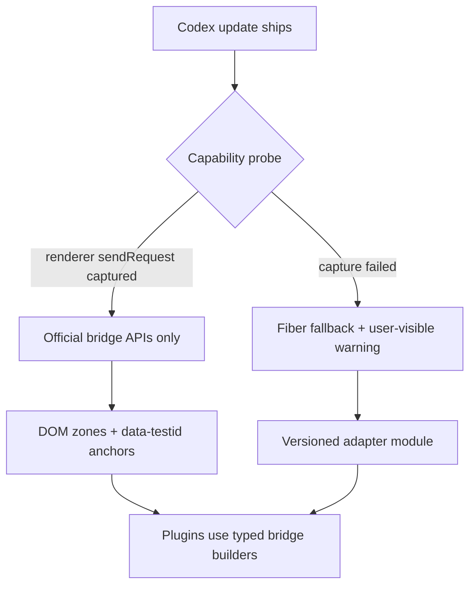

> 本文是 [sdk-fragility.md](../sdk-fragility.md) 的中文翻译，以英文原文为准。

# Explodex SDK 脆弱性(易变性)分析

> 日期: 2026-06-22  
> 范围: `sdk/explodex-sdk.js` v1.1.0、`plugins/` 下的插件、Codex 参考构建版本 `26.609.41114`。  
> 相关: [codex-architecture.md](./codex-architecture.md)、[composer-message-lifecycle.md](./composer-message-lifecycle.md)、[codex-root-runtime.md](./codex-root-runtime.md)、[early-injection-and-inspect-brk.md](./early-injection-and-inspect-brk.md)、[reasoning-effort-prefix-session.md](./reasoning-effort-prefix-session.md) §12。

本文档梳理了 Codex 更新时可能损坏的部分、哪些依赖建立在**压缩混淆后的标识符**之上、哪些建立在**能在混淆中存留的字符串字面量**之上，并给出架构改进建议。**不涉及实现** —— 仅为分析与建议。

---

## 执行摘要

| 等级 | 机制 | 下次 Codex 更新会坏吗? | 备注 |
|------|-----------|----------------------|-------|
| **严重** | `Function.prototype.call/apply` 猴子补丁（AppServer 捕获） | 经常 | 可能从未绑定成功；与其他代码冲突；注入时机问题 |
| **严重** | React fiber 遍历（`codex.*`） | 很可能 | 对象结构、hook 布局、`Function.toString` 匹配 |
| **高** | Tailwind / 布局类名选择器（`sidebarNav`） | 极可能 | 并非有意暴露的 API |
| **高** | 侧边栏标签文本锚定（`"Plugins"`、`"Settings"`） | 遇到 i18n 时 | 英文 UI 字符串 |
| **中** | 桥接消息 `type` 字符串 + payload 结构 | 有时 | 字面量能扛住压缩混淆；结构会演进 |
| **中** | `electronBridge` preload 方法名 | 有时 | 比渲染进程内部更稳定 |
| **中** | 输入框（Composer）DOM（`execCommand`、合成 `InputEvent`） | 有时 | ProseMirror 集成非公开 |
| **低** | `data-testid` / `data-*` portal 区域(zone) | 不太可能 | 有意的扩展点 |
| **低** | `codex:persisted-atom:` localStorage 前缀 | 不太可能 | 见于 `persisted-signal-*.js` |
| **低** | CSS 自定义属性（`--color-foreground` 等） | 不太可能 | 设计系统 token |

**核心洞察:** SDK **不**依赖压缩混淆后的 *JavaScript 变量名*（例如 `Ut`、`Dr`、`gw`）—— 这些每个构建都会变，且已被正确规避。它**确实**依赖:

1. **能在混淆中存留的字符串字面量**（桥接 `type` 名称、`data-*` 属性、内存中普通对象上的属性键）。
2. 通过 fiber 遍历发现的**运行时对象结构**（而非源码中的名称）。
3. 在没有稳定 `data-*` 钩子之处的 **DOM 结构与 CSS**。

---

## 1. AppServer 路由捕获

**位置:** `sdk/explodex-sdk.js` 顶部（`installAppServerRouterCapture`）。

### 它做了什么

全局补丁 `Function.prototype.call` 和 `Function.prototype.apply`。当任何函数以匹配 `{ sendRequest, setMessageHandler }` 的 `this` 被调用时，就绑定 `global.__explodexAppServerSend`。

### 失败模式

| 风险 | 为何会坏 |
|------|----------------|
| **时机** | CDP 注入在 React 挂载之后运行；路由器可能早已被构造，且方法通过直接调用（而非 `.call/.apply`）被调用。在 [reasoning-effort-prefix-session.md](./reasoning-effort-prefix-session.md) §12 中记录为 `appServerSend: false`。 |
| **调用风格** | 如果 Codex 内联 `sendRequest(type, payload)` 或使用绑定引用，补丁永远看不到路由器绑定。 |
| **全局副作用** | 渲染进程中每一次 `.call/.apply` 都要付出包装开销；DevTools、polyfill 或其他注入器可能对同一批原型链式打补丁。 |
| **检测启发式** | `isAppServerRouter` 只检查方法*名称* `sendRequest` / `setMessageHandler` —— 如果 Codex 重命名这些方法，捕获会静默失败。 |

### 捕获失败时 `bridge.send` 的行为

回退到 `electronBridge.sendMessageFromView` → 主进程 AppServer。对于已有会话线程上的 **`update-thread-settings-for-next-turn`**，这条路径**不会更新**提交时输入框读取的渲染进程 Jotai/React 状态（[composer-message-lifecycle.md](./composer-message-lifecycle.md) §4–5）。插件会看到 `bridge.isAvailable() === true`，但设置更改对回合上下文来说是空操作。

### 变量名依赖

对压缩混淆后的局部变量**无依赖**。**方法名** `sendRequest`、`setMessageHandler` 是隐式契约。

### 更优实现（建议）

1. **早期启动注入:** 在 React 模块加载前通过 `Page.addScriptToEvaluateOnNewDocument` 注册一小段前置脚本 —— 参见 [early-injection-and-inspect-brk.md](./early-injection-and-inspect-brk.md)。
2. **Vendor/preload 钩子:** 通过一行 ASAR 补丁修改 `preload.js` 或主进程 bootstrap，把渲染进程 AppServer 路由器暴露出来 —— 稳定、显式、可按版本门控。
3. **收窄捕获范围:** 在提取出的 chunk 中拦截路由器构造位点（参见 [plans/narrow-appserver-capture.md](../../plans/narrow-appserver-capture.md)），而不是给整个 `Function.prototype` 打补丁。
4. **启动时能力探测:** `Explodex.bridge.probe({ type: "update-thread-settings-for-next-turn", dryRun: true })` —— 当仅剩 IPC 回退路径可用时记录日志并在 UI 中给出警告。
5. **双路径 + 显式优先级:** 优先尝试捕获到的 `sendRequest`；若对设置敏感 API 只有主进程路径可用，绝不宣称 `isAvailable()`。

---

## 2. React fiber 内部机制（`Explodex.codex`）

**位置:** `reactFiber`、`reactFiberRoot`、`walkFibers`、`findThreadConversation`、`findNextTurnSettingsSetter`、`getQueryClient`。

这与 [codex-architecture.md](./codex-architecture.md) §12（"不要对 React fiber 打补丁"）相矛盾 —— SDK 并不*修改* fiber，而是**读取并调用**它们，其版本敏感性完全相同。

### 2.1 Fiber 键发现

```javascript
Object.keys(node).find((k) => k.startsWith("__reactFiber$") || k.startsWith("__reactContainer$"))
```

| 依赖 | 稳定性 |
|------------|-----------|
| `__reactFiber$` / `__reactContainer$` 前缀 | 与 Codex 捆绑的 React 版本相关（目前约为 React 19）。前缀格式多年来保持稳定，但**不是公开 API**。 |
| 以 `#root` 作为宿主 | 对本应用稳定；快捷键/次级窗口可能不同。 |

`window.__codexRoot`（参见 [codex-root-runtime.md](./codex-root-runtime.md)）是另一种 fiber 入口，但在提取出的资源中**未找到** —— 应视为机会性手段，而非长久之计。

### 2.2 `findThreadConversation(conversationId)`

扫描 hook 状态和 props（深度 ≤ 4，每个对象 ≤ 50 个键），寻找满足以下条件的对象：

- `val.id === conversationId`
- `val.latestThreadSettings` 是一个对象且 `"model" in val.latestThreadSettings`

| 假定的属性键 | 用途 |
|-----------------------|----------|
| `id` | 线程标识 |
| `latestThreadSettings.model` | `getThreadModel` |
| `latestThreadSettings.effort` | `getThreadEffort` 回退 |
| `latestCollaborationMode.settings.model` | 模型回退 |
| `latestCollaborationMode.settings.reasoning_effort` | Effort（rollout 路径） |
| `latestModel`、`latestReasoningEffort` | 旧版回退 |

这些是 Codex 会话管理器的**内存对象字段名** —— 在 bundle 中不会被混淆掉（源码中的对象字面量通常以字符串键形式存留）。但如果 Codex 重构管理器 schema，它们**仍可能改变**。

**失败模式:** 管理器改用不透明 Map、重命名 `latestThreadSettings`、把会话嵌套在 Symbol 键下，或在大型线程上超出 fiber 遍历预算（15 万节点）。

### 2.3 `findNextTurnSettingsSetter(conversationId)`

匹配 `useCallback` 元组 `[fn, deps]`，其中：

- `Function.prototype.toString.call(fn)` 包含 **`"update-thread-settings-for-next-turn"`**
- `deps[0] === conversationId`

| 依赖 | 稳定性 |
|------------|-----------|
| 函数源码中的桥接 type 字符串 | **高** —— 字符串字面量能扛住压缩混淆 |
| `useCallback` 元组结构 `[fn, deps]` | **中** —— React hook 布局稳定，但扫描所有 hook 很脆弱 |
| `deps[0] === conversationId` | **中** —— 如果 Codex 重构下拉组件，依赖顺序可能变化 |
| `Function.toString()` 可靠性 | **低到中** —— 生产构建中混淆器可能剥离或改动函数体 |

这是 SDK 中**最巧妙也最脆弱**的路径。它驱动 `applyThreadSettingsForNextTurn`，而 reasoning-effort-prefix 插件依赖该函数。

### 2.4 `getQueryClient()`

从 `document.querySelector("nav")` 开始遍历 fiber 树，寻找带有 `getQueryCache` + `setQueryData` 的 `fiber.memoizedProps.value`。

`storage.globalState.set` → `syncGlobalStateQueryCache` 使用它，配合硬编码的查询键：

```javascript
["vscode", "get-global-state", JSON.stringify({ key })]
```

| 风险 | 影响 |
|------|--------|
| React Query provider 移出 `nav` | 缓存同步变成空操作；UI 在重新拉取前可能显示过期的全局状态 |
| 查询键格式变化 | 缓存条目过期或错误 |
| 存在多个 QueryClient | 可能同步到错误的 client |

### 更优实现（建议）

1. **设置只走官方桥接:** 一旦渲染进程 `sendRequest` 能被可靠捕获，就使用 `update-thread-settings-for-next-turn`，在生产环境放弃 fiber setter 调用。
2. **Fiber 作为可选回退:** 将 `codex.applyThreadSettingsForNextTurn` 置于 `Explodex.meta.capabilities.inRendererSettings === false` 之后。
3. **带版本号的适配器:** `sdk/adapters/conversation-shape-v26.js`，用探针在遍历前于运行时校验对象结构。
4. **移除 `getQueryClient` 同步:** 只依赖 `bridge.rpc("set-global-state")`；让 Codex 自行失效其查询（或调用已找到的、有文档的失效接口）。
5. **仅调试用的 fiber 工具:** 把 `walkFibers` / `getThreadConversation` 挪到单独的调试 bundle，不作为默认插件 API。

---

## 3. 桥接与 IPC 层

**位置:** `bridge`、`postMessageToCodex`、`http`。

### 相对稳定的依赖（字符串字面量）

这些 `type` / 方法字符串出现在主进程和渲染进程的处理器中，通常能**扛过** Vite 压缩混淆：

| 字符串 | 用途 |
|--------|-------|
| `update-thread-settings-for-next-turn` | 线程模型/effort |
| `set-default-model-config-for-host` | 首页输入框默认值 |
| `start-turn-for-host`、`steer-turn-for-host` | 回合（插件不应合成调用） |
| `navigate-to-route` | `bridge.navigate` |
| `fetch`、`cancel-fetch`、`fetch-response` | HTTP 代理 |
| `get-setting`、`set-setting` | 设置 RPC |
| `get-global-state`、`set-global-state` | 全局状态 RPC |
| `open-external`、`quit-app` | 插件重启 |
| `log-message` | 被抑制的失败日志 |

### `electronBridge` preload 接口面

| 方法 | 重命名后的风险 |
|--------|-----------------|
| `sendMessageFromView` | 所有 `bridge.send` / IPC 回退 |
| `getSystemThemeVariant`、`subscribeToSystemThemeVariant` | 主题 |
| `getBuildFlavor`、`usesOwlAppShell` | Shell 检测 |

Preload API 比渲染进程内部**更稳定**，但对第三方没有文档。

### Payload 结构风险

| API | 假定的字段 |
|-----|----------------|
| `update-thread-settings-for-next-turn` | `{ conversationId, threadSettings: { model, effort } }` |
| `fetch` | `{ requestId, method, url, headers, body }` |
| `fetch-response` | `{ requestId, responseType, status, bodyJsonString, errorMessage }` |
| `get-setting` / RPC | `{ params: { key } }` 对比扁平 body（SDK 对 `get-global-state` 特殊处理） |

Effort 字段命名分裂：threadSettings 中用 `effort`，而 `collaborationMode.settings` 中用 `reasoning_effort`（[composer-message-lifecycle.md](./composer-message-lifecycle.md) §4）。插件必须针对每条代码路径使用 Codex 期望的同名字段。

### 自定义事件桥接

`postMessageToCodex` 在 `window` 上派发 `codex-message-from-view`。这是 Explodex 的约定，不是 Codex 官方 API。`bridge.on` 监听 `window.message` 并按 `data.type` 分发 —— 依赖 Codex 向渲染进程发送结构化消息。

### 更优实现（建议）

1. **桥接 type 注册表:** 在 `meta.bridgeTypes` 中按 Codex 版本从提取出的 `app-main-*.js` 生成。
2. **按 API 提供带类型的 payload 构造器**，插件无需手写结构。
3. **区分 `bridge.settings` 与 `bridge.transport`**，让调用方知道哪条路径会更新渲染进程状态。
4. **Codex 版本门控:** 从 `electronBridge` 或 package 探针获取 `meta.codexVersion`；针对未测试过的版本范围运行时给出警告。

---

## 4. DOM 注入区域(zone)与注入

**位置:** `ZONE_DEFINITIONS`、`resolveZoneAnchor`、`observeZone`、`inject`。

### 选择器稳定性（最好 → 最差）

| 区域(zone) | 主要选择器 | 稳定性 |
|------|-------------------|-----------|
| `aboveComposer` | `[data-above-composer-portal]`、`#above-composer-portal` | 高 |
| `aboveComposerQueue` | `[data-above-composer-queue-portal]` | 高 |
| `mcpAppPortal` | `[data-mcp-app-portal-target="true"]` | 高 |
| `threadFooter` | `[data-thread-scroll-footer="true"]` | 高 |
| `browserSidebarBanner` | `[data-testid="browser-sidebar-top-banner-portal"]` | 高 |
| `homeAmbient` | `[data-home-ambient-suggestions]` | 高 |
| `sidebar` | `[data-testid="app-shell-floating-left-panel"]`、`aside.app-shell-left-panel` | 中（类名回退） |
| `composerActions` | `.ProseMirror`、`[class*="composer" i]` | 中 |
| `statusOverlay` | `body` | 稳定但粗糙 |

### React 协调（reconciliation）

注入的节点位于 React fiber 树**之外**。Codex 重新渲染可能移除插件 DOM。`observeZone` + `includeMutations: true` 可缓解，但会给 `document.documentElement` 子树增加 MutationObserver 开销。

### `closestComposerShell`

使用 `[class*="composer" i]` 和向上遍历父节点 —— 如果布局组件重命名就会脆弱。

### 更优实现（建议）

1. **区域(zone)健康检查:** SDK 初始化时探测每个区域(zone)，把缺失的锚点记录到 `Explodex.log` 并展示在 shell UI。
2. **按区域(zone)限定观察范围:** 尽可能观察 `#root` 或已知的 portal 父节点，而不是整个 `documentElement`。
3. **向 Codex 团队申请官方插件区域(zone)** / 仅在万不得已时把新的 `data-explodex-*` 钩子作为 vendor 补丁落地。

---

## 5. 侧边栏导航（`sidebarNav`）

**位置:** `findNavByLabels`、`footerRowFor`、shell 插件的 `insertAfter(["Plugins", "Skills"], ...)`。

### 高脆弱性

| 机制 | 问题 |
|-----------|---------|
| **标签文本** `"Plugins"`、`"Skills"`、`"Settings"` | 本地化即坏；标签可能随产品文案变化 |
| **Tailwind 类名** `div.flex.items-center.gap-2`、`div.flex.items-center.gap-px` | 工具类组合随设计重构变化 |
| **类名子串匹配** `[class*='profile-footer' i]`、`[class*='ProfileFooter' i]` | 依赖类名字符串中残留的源码组件名 |
| **`li` / 通用 `div` 父节点遍历** | 侧边栏结构重设计会破坏插入点 |

### 更优实现（建议）

1. 在提取出的 chunk 中 grep 侧边栏导航项上的 `data-testid`（例如设置入口），并锚定到这些属性。
2. **固定区域(zone)挂载:** 使用 `inject.mount("sidebar", ...)` 挂到面板顶部/底部，而不是相对于某个标签 insertAfter。
3. **i18n 友好的锚点:** 用 `data-testid` 或 `href` 路径（`/settings`、`/plugins`）而不是可见文本。
4. **Shell 插件**在生产环境不应硬编码英文标签；从 `meta` 或配置读取。

---

## 6. 输入框（Composer）辅助函数

**位置:** `composer.getInput`、`insertText`、`getText`。

### 依赖

| 机制 | 风险 |
|-----------|------|
| `.ProseMirror` 类名 | 历史上稳定；不是 Codex 契约 |
| `document.execCommand("insertText")` | 已废弃；可能从 Chromium 移除 |
| 合成 `InputEvent` | 如果 ProseMirror 只监听内部事务，可能忽略它 |
| 防护条件: `[role="dialog"][data-state="open"]`、`[data-codex-terminal]:focus-within` | Radix / 特性专属 |

### 插件使用的 data 属性（经由 SDK 区域(zone)）

| 属性 | 插件用途 |
|-----------|--------------|
| `data-above-composer-conversation-id` | 线程 ID 解析 |
| `data-above-composer-host-id` / `data-host-id` | 主机 ID |

只要 Codex 把 composer portal 保留为扩展面，稳定性就很高。

### 更优实现（建议）

1. **优先使用 portal 属性**获取会话/主机 ID；路径正则仅作为回退。
2. 当 `execCommand` 失败时，把**剪贴板粘贴路径**作为 `insertText` 的回退。
3. **不要向只需要设置的插件暴露低层 composer 接口** —— effort/model 保持在 `codex.*` / 桥接上。

---

## 7. 存储

**位置:** `storage.persisted`、`storage.settings`、`storage.globalState`。

| 键 / 模式 | 稳定性 |
|---------------|-----------|
| `codex:persisted-atom:` 前缀 | 高 —— 与 `persisted-signal-*.js` 匹配 |
| `explodex-plugin-enabled` | Explodex 自有 |
| `meta.persistedKeys` 中的全局状态键 | 中 —— Codex 内部名称（`sidebar-organize-mode-v1` 等） |
| `thread-project-assignments`、`sidebar-project-thread-orders` | 中 —— pin-scope-menu 使用 |

`storage.persisted` 直接读写 `localStorage` —— 之所以有效是因为 Codex 把 atom 镜像到这里，但绕过官方 API 时可能与 Codex 的内存存储发生**写竞态**。

### 更优实现（建议）

1. 按插件记录哪些键是**只读**、哪些**可安全写入**。
2. 必须与服务端/electron 持久化保持一致的全局状态写入，优先用 `bridge.rpc`。
3. Explodex 的键只放在 `explodex:` 命名空间下；未经逆向验证绝不写任意 `codex:persisted-atom:` 键。

---

## 8. HTTP 层

**位置:** `http.request`、`/wham/usage`、`vscode://codex/` RPC 回退。

| 依赖 | 风险 |
|------------|------|
| `OAI-Language`、`originator: Codex Desktop` 请求头 | 服务端可能强制执行 |
| `/wham/usage`、`/wham/rate-limit-reset-credits` | 端点路径 |
| 响应 JSON 结构 | `rate_limit.primary_window` 等（usage-reset-sidebar） |
| `vscode://codex/${method}` 回退 RPC | Codex 内部 URL scheme |

使用 `http.get` 的插件不仅耦合 Codex 桌面版本，还耦合 **OpenAI 后端契约**。

---

## 9. UI 组件与设计 token

**位置:** `BUTTON_*` 常量、`installStyles`、`components.*`。

| 依赖 | 风险 |
|------------|-----------|
| CSS 变量 `--color-foreground`、`--color-bg-primary` 等 | 低到中；设计 token 重命名 |
| 注释引用 `button-DO-oxX3-.js` | chunk 哈希每次构建都变（仅文档用途） |
| `BUTTON_RADIUS` Tailwind 类名字符串 | **并未用于样式** —— 以内联样式为主；属于死代码负担 |
| z-index `2147483647` | 若 Codex 提高浮层层级会冲突 |

仅影响外观 —— 不影响桥接/设置的正确性。

---

## 10. 插件生命周期与注入运行时

| 机制 | 风险 |
|-----------|------|
| 用 `new Function(source)` 加载插件 | CSP / 安全策略收紧时会失效 |
| `global.__EXPLODEX_PLUGIN_CATALOG__` | Explodex 自有 |
| `global.__EXPLODEX_PATHS__.relaunchScript` | 打包契约 |
| `destroy()` / 重新加载 | 必须重新执行捕获钩子；原型补丁在重载后仍存在 |

---

## 11. 插件级耦合

| 插件 | 风险最高的依赖 |
|--------|---------------------------|
| `reasoning-effort-prefix` | `codex.applyThreadSettingsForNextTurn`、portal 会话 id、composer `insertText`、前缀目录与 Codex effort 枚举的一致性 |
| `pin-scope-menu` | 全局状态键、原生置顶按钮 aria-label 正则（`PIN_LABEL_RE`）、侧边栏 DOM 拦截 |
| `usage-reset-sidebar` | `/wham/*` 响应结构、侧边栏 `"Settings"` 标签插入 |
| `explodex-shell` | 导航标签 `"Plugins"`、`"Skills"` |

---

## 12. 哪些部分*不*依赖压缩混淆后的变量名

SDK 正确地避免了对提取 chunk 里 `Ut`、`Dr`、`gw`、`sC` 这类符号做 grep。它使用的是：

- **桥接 type 字符串**（混淆安全）
- **`data-*` / `data-testid`**（混淆安全）
- 运行时对象上的**对象属性键**（不是 bundle 源码中被混淆的*局部*名）
- **React 内部键前缀**（`__reactFiber$`）—— 属于 React 约定，与 Codex 专属混淆无关

主要的困惑点：像 `latestThreadSettings` 这样的**属性名**在源码中作为对象字面量键出现时不会被混淆掉，但它们仍然是**私有应用 schema**，在重构中可能变化。

---

## 13. 推荐架构（未来）

优先级顺序：



### 具体举措

| 举措 | 解决的问题 | 工作量 |
|------------|-----------|--------|
| 通过 preload / vendor 暴露 `rendererAppServer.send` | AppServer 捕获、设置空操作 | 中 —— 需要补丁纪律 |
| 收窄 AppServer 捕获 + 移除全局原型补丁 | 性能、可调试性 | 中 —— [plans/narrow-appserver-capture.md](../../plans/narrow-appserver-capture.md) |
| 初始化时探测 `meta.capabilities` 对象 | 静默失败 | 低 |
| 拆分 `sdk/src/` + 按 Codex 版本提供适配器 | 可维护性 | 中 —— [plans/split-sdk-modules.md](../../plans/split-sdk-modules.md) |
| 用 testid/路径锚点替代基于标签的 `sidebarNav` | i18n、布局 | 低到中 |
| 桥接可用后废弃 `codex.*` fiber 设置 API | fiber 脆弱性 | 桥接修复后为低 |
| 每次发布跑 CDP 冒烟测试 | 回归检测 | 中 —— [plans/runtime-smoke-tests.md](../../plans/runtime-smoke-tests.md) |
| 在 `plugin.json` 中声明 Codex 版本范围 | 用户预期 | 低 |

### 未来 SDK 代码应避免的反模式

1. 打 `Function.prototype` 补丁却没有回退遥测。
2. 把 `Function.toString()` 匹配当作**唯一**策略。
3. 用 Tailwind 工具类选择器做布局锚定。
4. 用英文 UI 字符串匹配做导航。
5. 当设置敏感调用走的是坏掉的 IPC 路径时仍宣称 `bridge.isAvailable()`。
6. 在没有逐构建集成测试的情况下扩大 fiber 遍历。

---

## 14. Codex 升级检查清单

当 `vendor/Codex.app` 刷新后：

1. 重新提取 `webview/assets/`；diff `app-main-*.js` 中的桥接处理器映射，检查被重命名的 `type` 字符串。
2. 确认 portal 属性仍然存在：`data-above-composer-portal`、`data-thread-scroll-footer` 等。
3. 运行能力探测：`__explodexAppServerSend` 已绑定？`applyThreadSettingsForNextTurn` 在测试线程上返回 true？
4. 确认 `codex:persisted-atom:` 前缀在 `persisted-signal-*.js` 中未变。
5. 检查侧边栏结构：`flex.items-center.gap-2` 的页脚还存在吗？
6. 运行 reasoning-effort-prefix E2E：rollout `turn_context` 显示预期的 `reasoning_effort`。
7. 更新 `meta.codexVersion` 和本文的参考构建版本行。

---

## 15. 文档一致性说明

[codex-architecture.md](./codex-architecture.md) §12 建议坚持以 DOM 区域(zone)为主、避开 React fiber。SDK 的 `codex` 命名空间在设置应用上违背了该规则的精神。应把 fiber 访问当作**临时回退**处理，在此处及 §12 交叉链接中说明，并按 [reasoning-effort-prefix-session.md](./reasoning-effort-prefix-session.md) §12 优先修复桥接。
